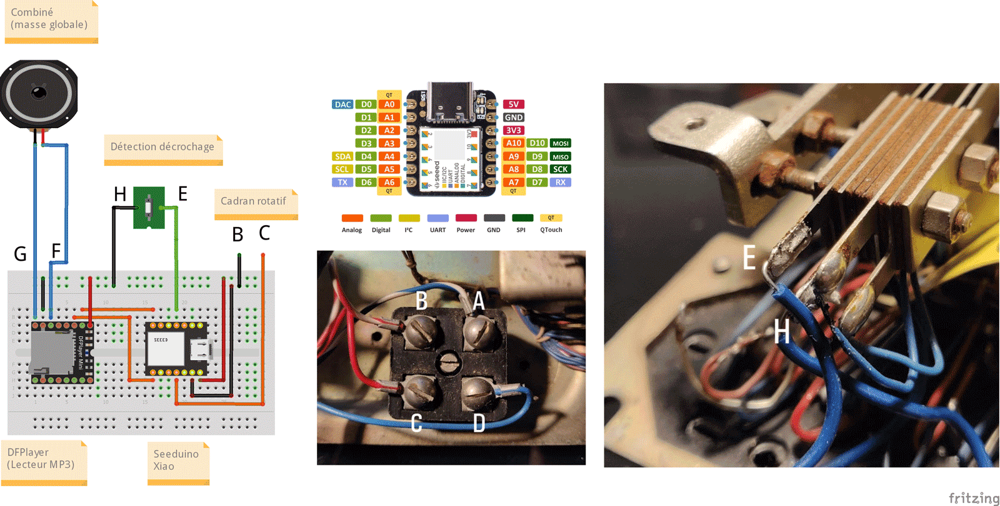

# Boite à histoires "Socotel U43"

Ce modèle date de 1943 (d'où son nom).

*Photo par [Lulu La Lucette](https://lululalucette.com)*

# Pré-requis
Sur la carte micro-SD ou la clé USB, créez un dossier nommé *MP3* et stockez-y vos fichiers à faire jouer par le téléphone.
Ils doivent être prefixés par un numéro à 4 chiffres, qui les fera correspondre au chiffre composé sur le cadran : 0001.mp3 ou 0001 - cequevousvoulez.mp3 pour le morceau 1, etc)

# Utilisation
Il vous suffit de décrocher le combiné, de composer un ou plusieurs chiffres et d'écouter l'histoire qui vous est racontée.

# Principe de fonctionnement
On reprend ici la logique du modèle S63 https://github.com/samy/une-histoire-au-bout-du-fil/blob/main/Boite_a_histoires_S63/README.md

Le boitier électronique associé à ce projet vient se brancher sur la connectique existante du téléphone, pour se relier à trois éléments déja présents:
- la détection du décrochage
- le combiné (et son haut-parleur)
- et surtout le cadran rotatif

Deux différences majeures par rapport à la version S63:
- le boitier a du être réduit en hauteur, l'espace disponible étant plus réduit
- afin d'éviter d'être parasité par le circuit du téléphone, on rajoute ici un sucre "maison" pour relier le cadran et l'Arduino

Il est désormais possible de composer des numéros entrre 1 et 4 chiffres !

# Schéma du circuit

  

Comme mon précédent modèle de téléphone, on utilise ici un DFPlayer, mais combiné cette fois à un [Seeeduino Xiao](https://wiki.seeedstudio.com/Seeeduino-XIAO/) qui a l'avantage d'être extrèmement compact (sans pour autant sacrifier les performances).

La seule particularité ici est que le décrochage n'a pu être géré directement par les bornes situées sous l'appareil : en effet, comme pour le cadran, les parasites liés au circuit sont trop importants. J'ai donc du directement me brancher sur les contacts du système électromécanique qui s'enclenche quand on raccroche.

# Gestion du volume (optionnelle)
Celle-ci peut s'activer via la constante VOLUME_HANDLING dans le code.
Il vous suffit ensuite de cabler un potentiomètre en reprenant la convention suivante:

# Compatibilité avec d'autres cadrans
Si vous avez un autre modèle qu'un Socotel S63 ou un U43, les cablâges sont sans doute tout de même similaires à l'image ci-dessous. Seuls les cables rouge et blanc-rouge sont utiles dans notre cas.

# Licence
 Ce projet est partagé sous la licence <a rel="license" href="https://creativecommons.org/licenses/by-nc-sa/4.0/deed.fr">Attribution - Pas d’Utilisation Commerciale - Partage dans les Mêmes Conditions 4.0 International</a>.

# Ressources:
- Autre projet, réalisé par [comeetie](https://github.com/comeetie/), qui utilise un U43, mais directement avec un Raspberry Pi: [https://github.com/comeetie/Monvieuxtelephone/](https://github.com/comeetie/Monvieuxtelephone/) (et qui ajoute pas mal de fonctionnalités: météo, horaires de passage du RER, etc)
- Source d'inspiration: [Le projet S63 de Revolunet](https://github.com/revolunet/s63)
