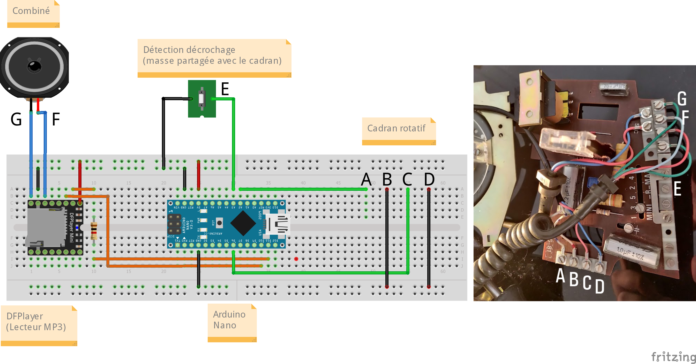

# Boite à histoires "Socotel S63"

(source : [x0r.fr](https://x0r.fr/blog/53) )

# Schema du circuit

La masse de l'interrupteur de décrochage est partagée avec celle du cadran rotatif, un seul fil est donc nécessaire pour indiquer l'état (la masse est représentée sur le schéma mais on utilise ici les connexions déja présentes sur le circuit du téléphone).

⚠️ Une soudure est à à réaliser sur la carte électronique du téléphone, à l'endroit indiqué sur cette image:

# Matériel à rassembler
- Un [Arduino Nano](https://www.gotronic.fr/art-carte-arduino-nano-12422.htm) (mais vous pouvez utiliser d'autres modèles sans problème, selon votre boitier)
- Un [DFPlayer Mini](https://www.gotronic.fr/art-module-mp3-dfr0299-22404.htm)
- Une résistance de 1kΩ

# Pré-requis avant utilisation
Sur la carte micro-SD, créez un dossier nommé _MP3_ et stockez-y vos fichiers à faire jouer par le téléphone. Ils doivent être prefixés par un numéro à 4 chiffres, qui les fera correspondre au chiffre composé sur le cadran :
- **0001.mp3** ou **0001 - cequevousvoulez.mp3** pour le morceau 1,
- **0002.mp3** ou **0002 - cequevousvoulez.mp3** pour le morceau 2,
- etc

# Code Arduino
On utilise ici deux bibliothèques non natives :
- [*DFRobotDFPlayerMini*](https://github.com/DFRobot/DFRobotDFPlayerMini) (installable via le gestionnaire de bibliothèques)
- [*RotaryDial*](https://github.com/markfickett/Rotary-Dial), (téléchargeable sur Github et installable au format ZIP)

Le [code source](./Boite_a_histoires_S63.ino) est abondamment commenté en français.

# Etiquette du cadran
Celle-ci est constituée d'un disque de 51mm de diamètre, et la police utilisée semble être du Univers Condensed Medium avec en 7.5pt un crénage de 46 (merci à [Jean-François Porchez](https://typofonderie.com) pour la suggestion de la police Univers)

