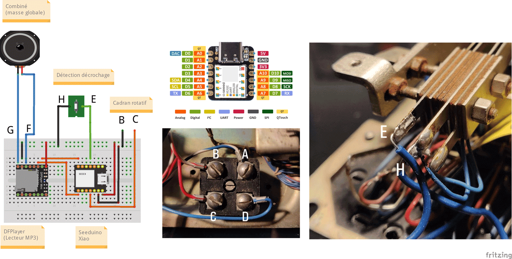

# Boite à histoires "Socotel U43"

Ce modèle date de 1943 (d'où son nom).

*Photo par [Lulu La Lucette](https://lululalucette.com)*

# Pré-requis
Sur la carte micro-SD, créez un dossier nommé *MP3* et stockez-y vos fichiers à faire jouer par le téléphone.
Ils doivent être prefixés par un numéro à 4 chiffres, qui les fera correspondre au chiffre composé sur le cadran : 0001.mp3 ou 0001 - cequevousvoulez.mp3 pour le morceau 1, etc)

# Utilisation
Il vous suffit de décrocher le combiné, de composer un (seul) chiffre et d'écouter l'histoire qui vous est racontée.

# Principe de fonctionnement
On reprend ici la logique du modèle S63 https://github.com/samy/une-histoire-au-bout-du-fil/blob/main/Boite_a_histoires_S63/README.md

Le boitier électronique associé à ce projet vient se brancher sur la connectique existante du téléphone, pour se relier à trois éléments déja présents:
- la détection du décrochage
- le combiné (et son haut-parleur)
- et surtout le cadran rotatif

Deux différences majeures par rapport à la version S63:
- le boitier a du être réduit en hauteur, l'espace disponible étant plus réduit
- afin d'éviter d'être parasité par le circuit du téléphone, on rajoute ici un sucre "maison" pour relier le cadran et l'Arduino

# Schéma du circuit

  

Comme mon précédent modèle de téléphone, on utilise ici un DFPlayer, mais combiné cette fois à un [Seeeduino Xiao](https://wiki.seeedstudio.com/Seeeduino-XIAO/) qui a l'avantage d'être extrèmement compact (sans pour autant sacrifier les performances).

La seule particularité ici est que le décrochage n'a pu être géré directement par les bornes situées sous l'appareil : en effet, comme pour le cadran, les parasites liés au circuit sont trop importants. J'ai donc du directement me brancher sur les contacts du système électromécanique qui s'enclenche quand on raccroche.

# Cablage
Les positions de A1 à J17 correspondent à celles d'une [uPesy Solderable Breadboard Mini](https://www.upesy.com/products/upesy-protoboard-breadboard-mini).
Les ports de A à H correspondent à ceux indiqués sur le schéma ci-dessus. Les positions s'entendent avec __le A à gauche et le J à droite__.

| Source    | Destination | Taille fil |
| ------------- | ------------- | ------------- |
| A3  | Port A  | >= 65mm |
| I2  | Port B  | >= 65mm |
| A7  | Port C  | >= 65mm |
| J2  | Port D  | >= 65mm |
| A4  | Port E  | >= 65mm |
| A15  | Port F  | >= 65mm |
| A17  | Port G  | >= 65mm |
| B16  | Port H  | >= 65mm |
| J4 | J9 | 22mm
| E9 | F9 (R 1kΩ) | - |
| A9 | A11 | 13mm |
| I5 | A12 | 42mm |
| B10 | H1 (+) | 50mm |
| C16 | H2 (-) | 63mm |

## Emplacement des cartes
| Carte    | Position |
| ------------- | ------------- |
| Seeeduino Xiao  | C1-C7 & G1-G7 |
| DFPlayer Mini  | D10-D17 & I10-I17 |

Sur un modèle standard de boitier les câbles reliant la breadboard aux contacts extérieurs doivent faire au moins 65mm de long.

# TODO
- Gérer des numéros à plusieurs chiffres (il faut cependant bien doser le timing pour déterminer s'il s'agit d'une pause entre deux chiffres ou si l'utilisateur a fini le numéro)
- Améliorer le filtrage du circuit pour pouvoir dans tous les cas utiliser les contacts de décrochage classiques
- Proposer une possibilité d'enregistrer du son via le combiné

# Licence
 Ce projet est partagé sous la licence <a rel="license" href="https://creativecommons.org/licenses/by-nc-sa/4.0/deed.fr">Attribution - Pas d’Utilisation Commerciale - Partage dans les Mêmes Conditions 4.0 International</a>.
